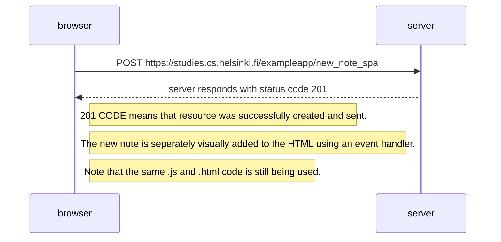

```mermaid
    sequenceDiagram
        participant browser
        participant server

        browser->>server: POST https://studies.cs.helsinki.fi/exampleapp/new_note_spa
        activate server
        server-->>browser: server responds with status code 201 
        Note right of browser: 201 CODE means that resource was successfully created and sent.

        Note right of browser: The new note is seperately visually added to the HTML using an event handler.

        Note right of browser: Note that the same .js and .html code is still being used.

```
